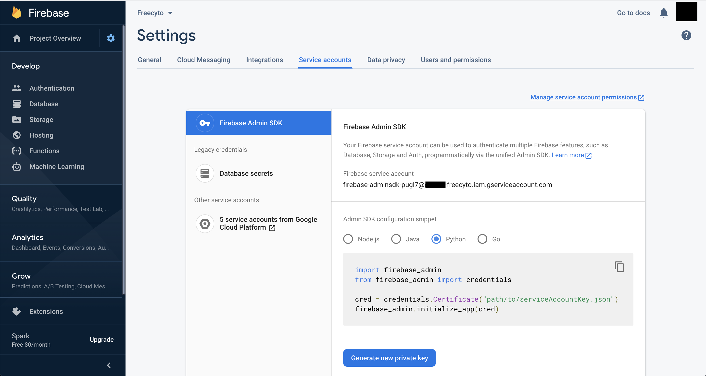
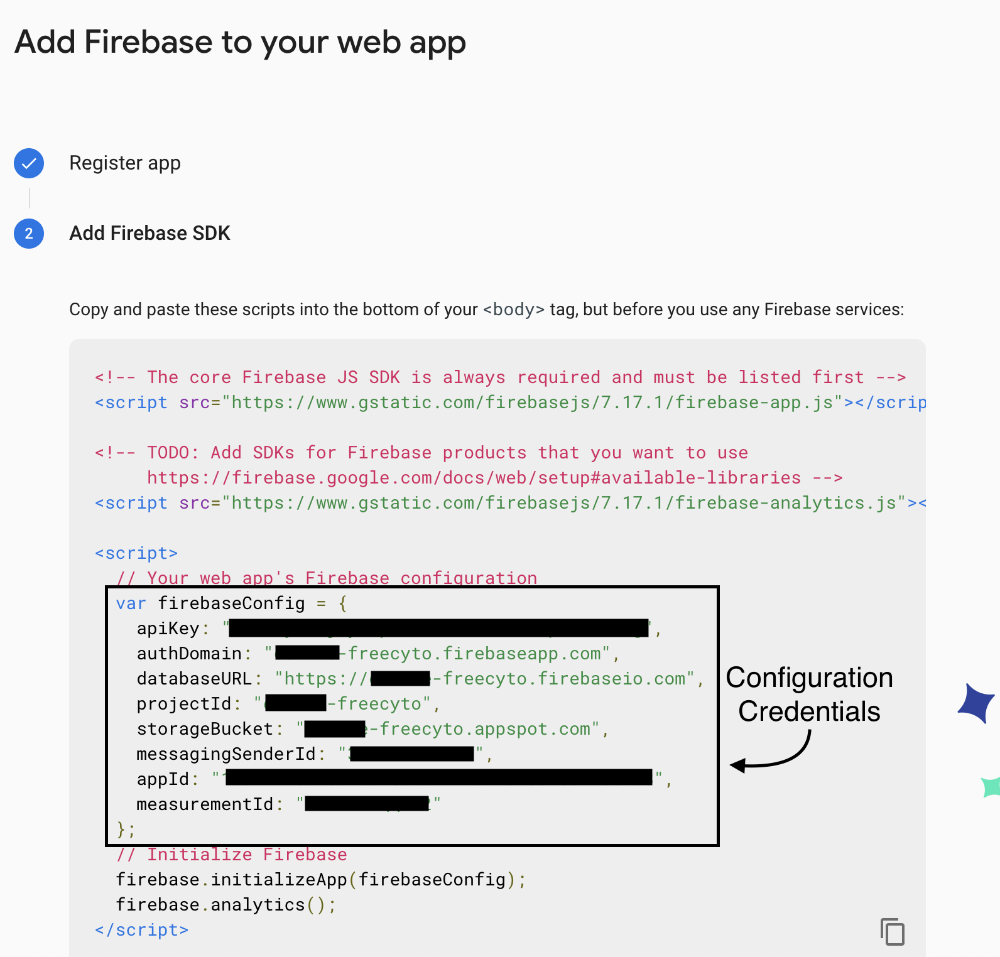

# Freecyto 
A python web application providing accessible and collaborative flow cytometry analysis.

# Getting started
Application: https://freecyto.com
Demo: https://www.youtube.com/watch?v=JlIVgxh4_YA

### Prerequisites

Install Xcode toolkit
```
xcode-select --install
```

## Mac OSX Setup (similar process for UNIX servers)

1. Create a new conda environment (Python 3.7)
```
conda create -n freecyto python=3.7
conda activate freecyto
```

Alternatively, use python's built in virtual environment
```
python3 -m venv freecyto
source freecyto/bin/activate
```

2. Install python dependencies
```
pip install numpy
pip install -r requirements.txt
pip install xlsxwriter
```

3. Create a Google Firebase Database to store your flow cytometry experiments.
	1. Setup a firebase account (https://console.firebase.google.com/).
	2. Create a new project with a name of your choice.
	3. Navigate into your project. Click `Develop` in the left panel and `Database` to create the database with default settings.
	4. Go back to the `Project Overview` page and create a web app by clicking the web icon on the front page. Proceed with the registration (do not check the `Also set up Firebase Hosting` option). 
	5. Navigate to the Settings page of the new web application. Under `Service Accounts`, select Python and generate a new private key. This will download your Google Cloud service account json file. 
 	6. Run the following command in terminal: 
  	```
 	export GOOGLE_APPLICATION_CREDENTIALS=/path/to/json
	```
	7. Obtain the Firebase configuration credentials in the script they provide. We will use this for step 4. 

4. Replace in /templates/*.html var config with your custom config in the step above.

	Configuration details:
	```
	var config = {
	  apiKey: "[APIKEY]",
	  authDomain: "[project-id].firebaseapp.com",
	  databaseURL: "https://[project-id].firebaseio.com",
	  projectId: "[project-id]",
	  storageBucket: "[project-id].appspot.com",
	  messagingSenderId: "[sender-id]",
	};
	```
* dashboard.html
* quick_vis.html
* upload.html
* user.html

5. Create a 'data' directory in the root path
```
mkdir data
```

6. Run the application
```
python wsgi.py
```

7. Go to http://localhost:1500 to view the application. 
